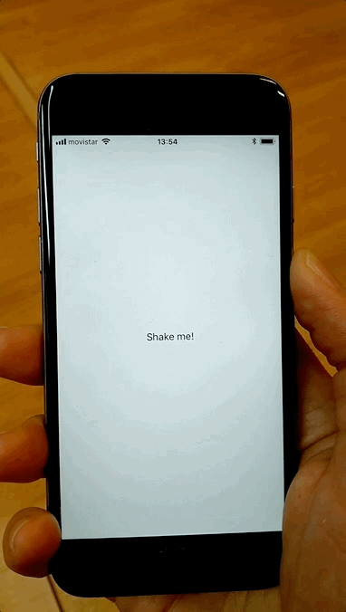

# WhenTheAppWasBuilt

How many times have you said "when was this app built" or "which version affects this bug"? Forget those, from now on just strongly shake your device and we'll show you when the app was built. That simple. [](https://www.nuget.org/packages/DevsDNA.WhenTheAppWasBuilt)

With Xamarin.Forms in mind, it also works on classical Xamarin.Android or Xamarin.iOS projects which share a common library.

 

## How to use it

Just four easy steps:

1. Add [DevsDNA.WhenTheAppWasBuilt](https://www.nuget.org/packages/DevsDNA.WhenTheAppWasBuilt) NuGet to both your PCL and platform projects;

2. In your Android's `MainActivity` class, add the following line just after Xamarin.Forms init. —pass whatever `Type` located at your core project (as the main `App` for instance), since such provides the actual date:

```csharp
global::Xamarin.Forms.Forms.Init(this, bundle);
// This line!
DevsDNA.WhenTheAppWasBuilt.TellMeWhenShaking(typeof(WhenTheAppWasBuiltExample.App));
```

3. The same goes for iOS' `AppDelegate` one:

```csharp
global::Xamarin.Forms.Forms.Init();
// And this other one!
DevsDNA.WhenTheAppWasBuilt.TellMeWhenShaking(typeof(WhenTheAppWasBuiltExample.App));
```

4. Strongly shake your devices!

### Ahead-of-shake (AOS) support

You don't have to force customers to shake their devices if don't want to, simply call

```csharp
DevsDNA.WhenTheAppWasBuiltCore.DisplayBuildDateAlert();
```

from wherever you want.

*Pst!* Have a look to the [Examples](Examples/) folder to quickly see it running!
